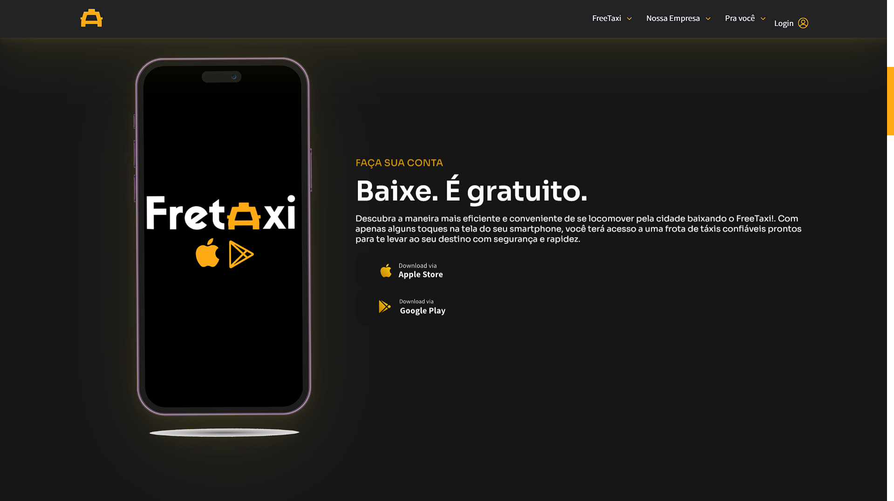
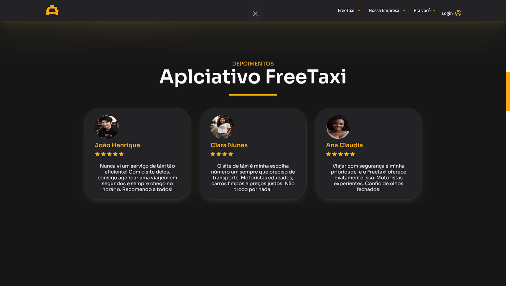

# Projeto Landing Page - FreeTaxi - Harison Rios 💻

> Landing Page - Imagem 1

> Landing Page - Imagem 2

> Landing Page - Imagem 3

> Landing Page - Imagem 4

## Comentários 

Projetinho de uma pagina web para um sistema de taxi (estilo uber).

## Tecnologias

      

## 📝 Licença

Esse projeto está sob licença. Veja o arquivo [LICENÇA](LICENSE.md) para mais detalhes.
